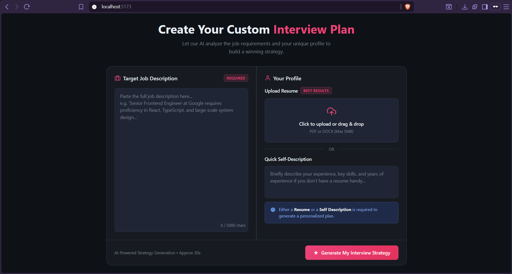
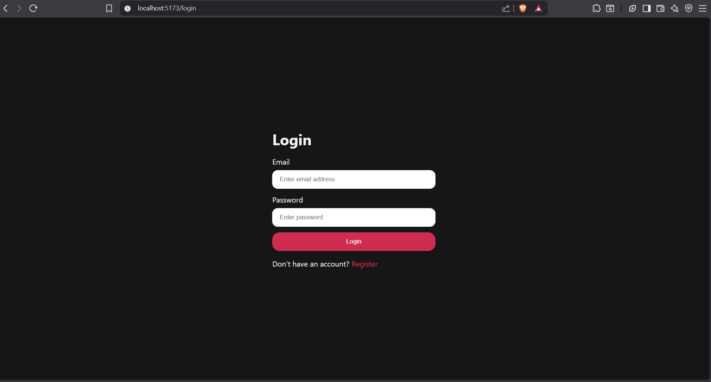
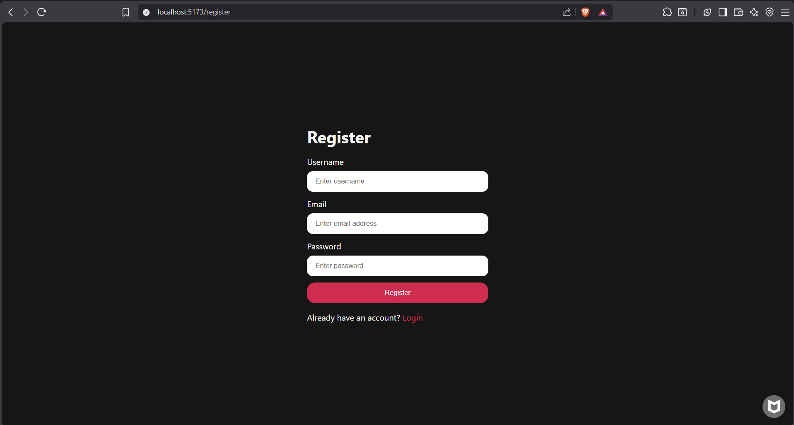
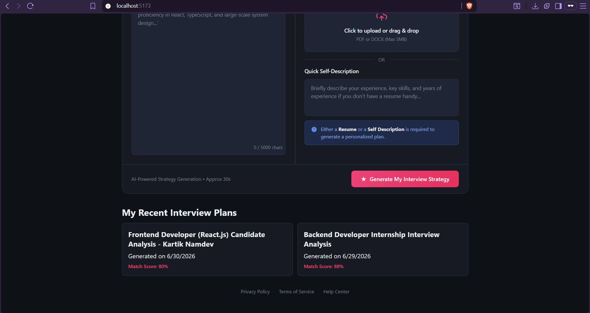
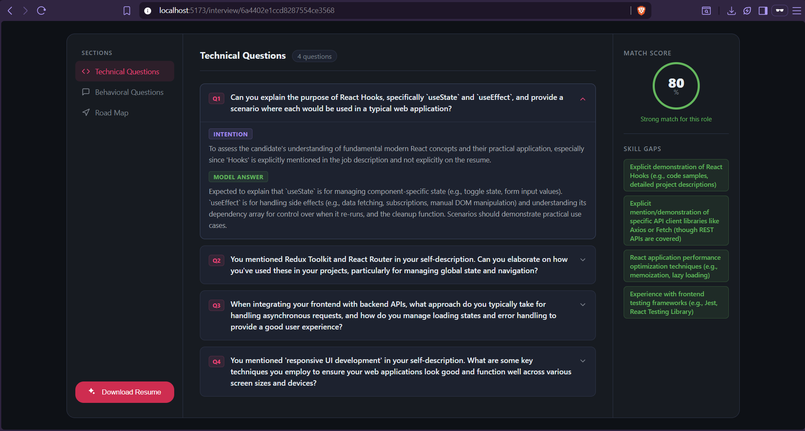
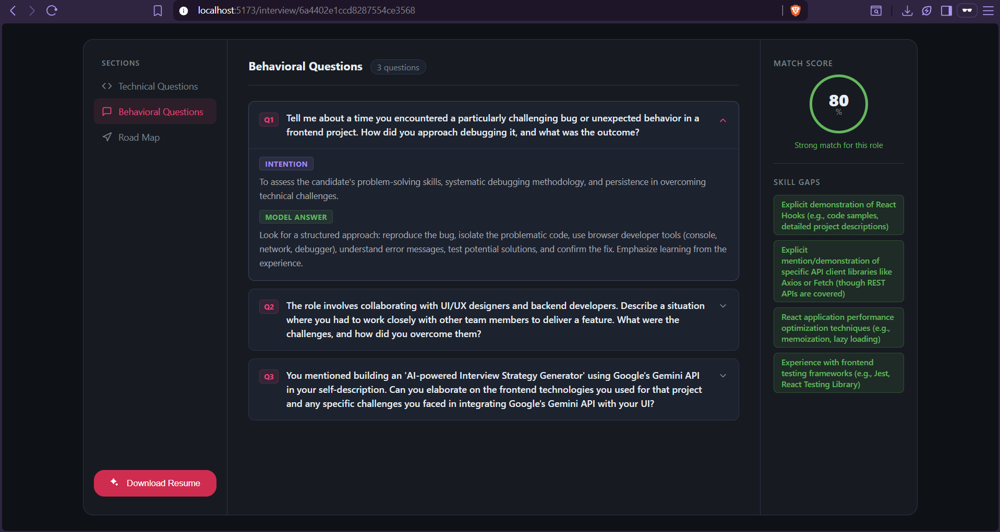
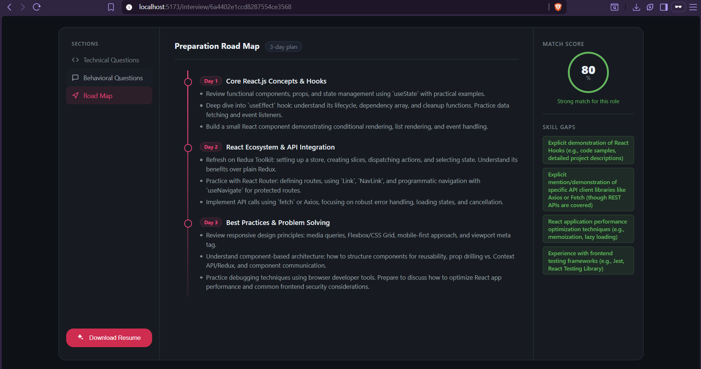

# 🚀 CareerPilot AI
### AI-Powered Personalized Interview Strategy Generator

CareerPilot AI is a full-stack AI application that helps job seekers prepare for interviews by analyzing their **Resume** and **Job Description**. It generates a personalized interview strategy, predicts technical interview questions, identifies skill gaps, and creates a roadmap for preparation using Google's Gemini AI.

---

## ✨ Features

- 🔐 User Authentication (JWT)
- 👤 User Registration & Login
- 📄 Upload Resume (PDF/DOCX)
- 📝 Paste Job Description
- 🤖 AI-Powered Resume Analysis
- 📊 Resume & Job Match Score
- 💪 Strengths & Weaknesses Analysis
- ❓ Technical Interview Questions
- 🗣️ Behavioral Interview Questions
- 📅 Personalized Learning Roadmap
- 📂 Previous Interview Reports
- 📱 Responsive Modern UI

---

# 🛠️ Tech Stack

## Frontend
- React.js
- React Router DOM
- SCSS
- Axios
- Context API
- Vite

## Backend
- Node.js
- Express.js
- MongoDB
- Mongoose
- JWT Authentication
- Multer
- Cookie Parser
- CORS
- dotenv

## AI & APIs
- Google Gemini API
- Google GenAI SDK

## Database
- MongoDB Atlas

## Other Tools
- Git & GitHub
- Postman
- Nodemon

---

# 📂 Project Structure

```text
CareerPilot AI
│
├── CareerPilot AI Frontend
├── CareerPilot AI Backend
└── README.md
```

---

# ⚙️ Installation

## Clone Repository

```bash
git clone https://github.com/<your-github-username>/CareerPilot-AI.git
```

## Install Frontend

```bash
cd CareerPilot\ AI\ Frontend
npm install
npm run dev
```

## Install Backend

```bash
cd CareerPilot\ AI\ Backend
npm install
npm run dev
```

---

# 🔑 Environment Variables

Create a `.env` file inside the backend.

```env
PORT=5000

MONGO_URI=Your_MongoDB_URI

JWT_SECRET=Your_JWT_Secret

GOOGLE_GENAI_API_KEY=Your_Gemini_API_Key
```

---

# 📸 Application Screenshots

## 🏠 Home Page

<p align="center">

</p>

<br><br>

---

## 🔐 Login Page

<p align="center">

</p>

<br><br>

---

## 📝 Register Page

<p align="center">

</p>

<br><br>

---

## 📄 Recent Interview Plan

<p align="center">

</p>

<br><br>

---

## ❓ Technical Questions

<p align="center">

</p>

<br><br>

---

## 🗣️ Behavioral Questions

<p align="center">

</p>

<br><br>

---

## 🛣️ Personalized Roadmap

<p align="center">

</p>

---

# 🧠 AI Workflow

```text
Resume Upload
        │
        ▼
Extract Resume Content
        │
        ▼
Job Description Analysis
        │
        ▼
Gemini AI Processing
        │
        ▼
Interview Strategy Generation
        │
        ├── Match Score
        ├── Strengths
        ├── Weaknesses
        ├── Technical Questions
        ├── Behavioral Questions
        └── Preparation Roadmap
```

---

# 🔒 Authentication Flow

- JWT Authentication
- Protected Routes
- HTTP-only Cookies
- Secure Password Hashing
- Login Persistence

---

# 📈 Future Improvements

- 🎤 Mock AI Interview
- 🎙️ Voice-based Interview
- 📹 Webcam Interview Analysis
- 🧠 AI Resume Builder
- 🌍 Multi-language Support
- 📊 Interview Performance Dashboard
- 📄 ATS Resume Score
- 📧 Email Report Sharing

---

# 👨‍💻 Author

**Kartik Namdev**

Computer Science Engineering Student

VIT Vellore

GitHub: https://github.com/<your-github-username>

LinkedIn: https://linkedin.com/in/<your-linkedin>

---

# ⭐ If you like this project

Give this repository a ⭐ on GitHub.
